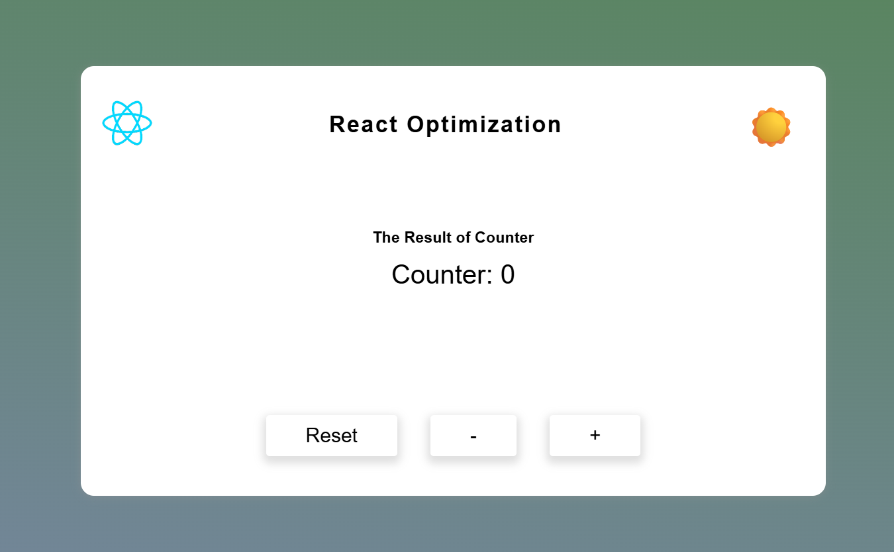

# ⚡ React Optimization Example

This project demonstrates **React optimization techniques** using `React.memo` and `useCallback`.

## 🚀 Features

- **`React.memo`** is used to prevent unnecessary re-renders of child components when props do not change.
- **`useCallback`** ensures functions are memoized and not recreated on every render.
- **Dark/Light mode toggle** to demonstrate prop updates.
- **Counter functionality** to show selective re-renders.

## 📊 How It Works

- When the **counter value** changes, only the `AppBody` component re-renders.
- The `AppHead` and `AppButtons` components remain stable thanks to memoization.
- This improves rendering performance and makes the app more efficient.

## 🛠️ Tech Stack

- React
- React.memo
- useCallback
- React Profiler (for performance testing)

## 🔍 Optimization Results

By using **React Profiler**, we can see that only the necessary components are re-rendered when state changes.  
This demonstrates how simple optimization patterns can make a real difference in React apps.

## 📸 Screenshot

## 🌐 Live Demo

<a href="https://aymaq-code.github.io/React-Optimization-/" target="_blank" rel="noopener noreferrer">
  Open Live Demo
</a>

---

Made with ❤️ using React.
